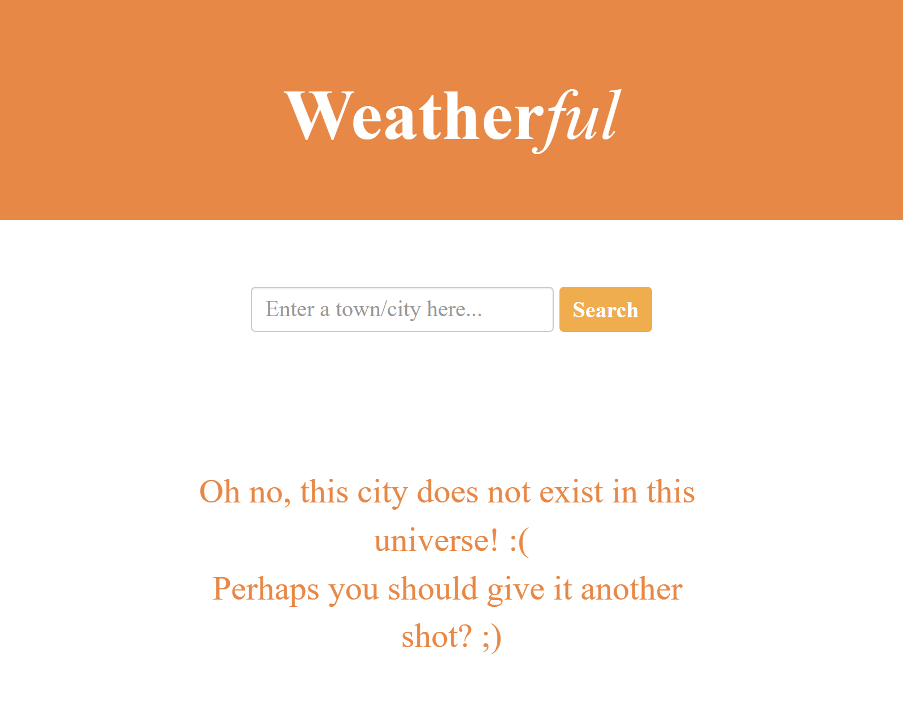

# WeatherFul API

### General Info:

A minimal weather app created with jQuery and Bootstrap in order to process and contextualize the data from OpenWeather API

### Technologies:
* HTML
* CSS
* JavaScript
* Bootstrap
* jQuery

### Technologies (Others):
* OpenWeather - API

### Preview:
API Response           | Erros Handling
:-------------------------:|:-------------------------:
  |  